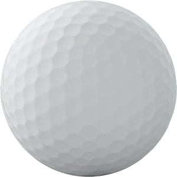

# Welcome to my GitHub Pages Site!

> They say code cleanliness is next to godliness

### A code snippet is below

*Recursion*

```python
def fib(n):
    if n == 0:
        return 0
    if n == 1:
        return 1
    
    return fib(n-1)+fib(n-2)
```

[Read more about recursion](https://en.wikipedia.org/wiki/Recursion)

[Look at this picture about recursion](assets/recursion.png)

### Here's a different section

You've made it to the next section! Congratulations! It's very nice to see you here, and I'm glad recursion didn't scare you away. If you need to go back to that section, [click here](#a-code-snippet-is-below).

Here's a list of things in order:
 1. One
 2. Two
 3. Three
 4. Four
 5. Five

Here's a list of things not in order:
 * There's
 * No
 * Order
 * Here
 * But
 * That's
 * Okay

Here are some tasks to complete before next class:
 - [x] Make this index page for my GitHub Pages site
 - [ ] Invent some novel method of solving a problem
 - [ ] Charge people lots of money to use your method
 - [ ] Make money and retire

Made it this far? Enjoy this golf ball.

